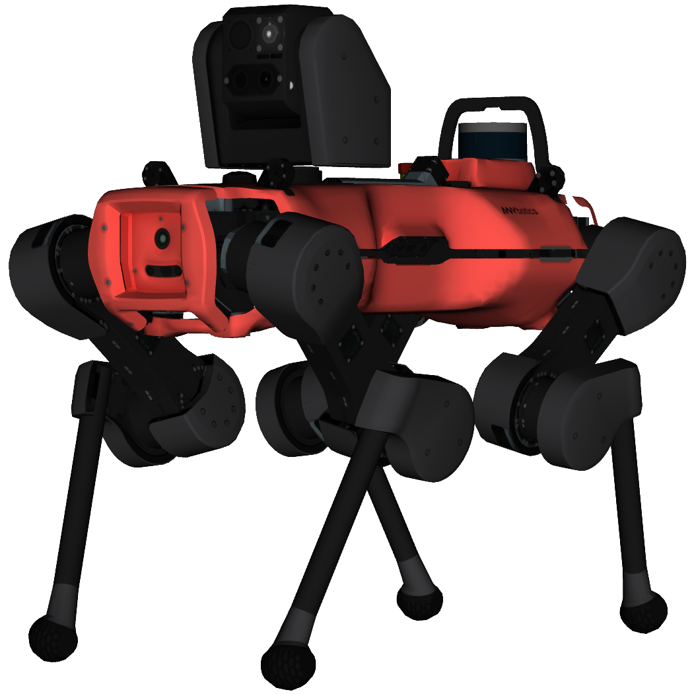

# ANYmal D Robot Description (URDF)
## Overview

This package contains a simplified robot description (URDF) of [ANYmal](https://www.anybotics.com/anymal) developed by [ANYbotics](https://www.anybotics.com).

The extended ANYmal D robot description, simulation, and control software is available exclusively to members of the [ANYmal Research community](https://www.anymal-research.org). For more information and membership applications, contact info@anybotics.com.

**Author & Maintainer: Linus Isler, [ANYbotics](https://www.anybotics.com)**

## License

This software is released under a [BSD 3-Clause license](LICENSE).

## Usage

Load the ANYmal description to the ROS parameter server:

    roslaunch anymal_d_simple_description load.launch

To visualize and debug the robot description, start the standalone visualization (note that you have to provide the following additional dependencies: `joint_state_publisher`, `joint_state_publisher_gui` ,`robot_state_publisher`, `rviz`):

    roslaunch anymal_d_simple_description standalone.launch

### Launch files

* **`load.launch`:** Loads the URDF to the parameter server. Meant to be included in higher level launch files.

* **`standalone.launch`:** A standalone launch file that starts RViz and a joint state publisher to debug the description.
